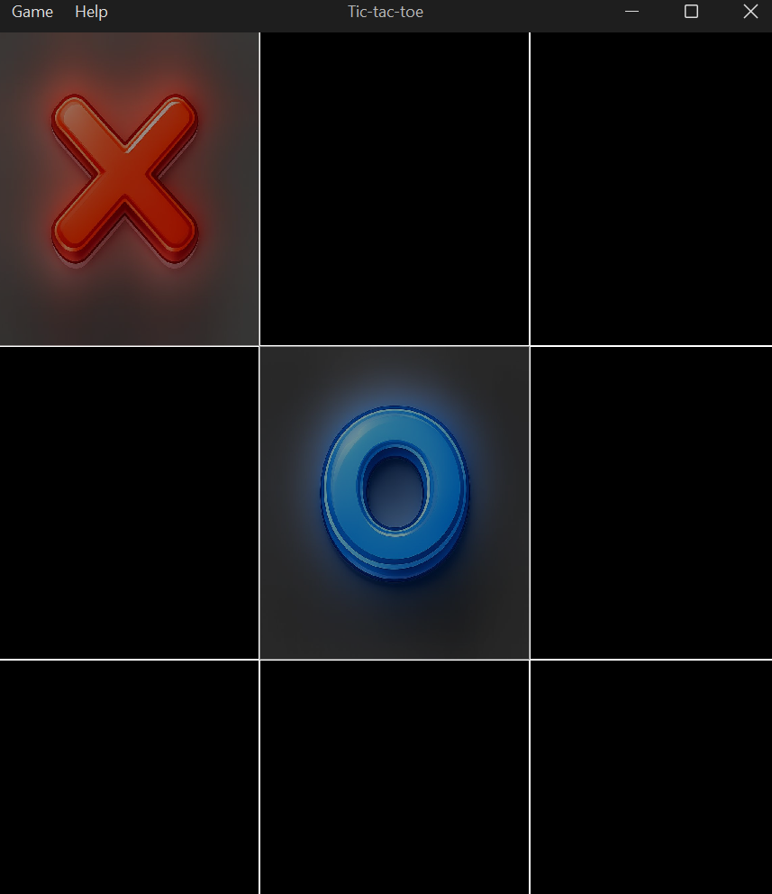

# Tic-Tac-Toe Game

A modern desktop implementation of the classic Tic-Tac-Toe game built with Java Swing, featuring an unbeatable AI opponent powered by the Minimax algorithm.



## Table of Contents

- [Features](#-features)
- [Technologies](#-technologies)
- [Requirements](#-requirements)
- [Installation](#-installation)
- [How to Build](#-how-to-build)
- [How to Run](#-how-to-run)
- [Game Rules](#-game-rules)
- [Project Structure](#-project-structure)
- [AI Implementation](#-ai-implementation)
- [Author](#-author)
- [License](#-license)

## Features

- **Modern Dark UI**: Sleek dark theme using FlatLaf (FlatMacDarkLaf) for an elegant user experience
- **Unbeatable AI**: Intelligent computer opponent using the Minimax algorithm
- **Custom Graphics**: Beautiful X and O symbols with semi-transparent rendering
- **Responsive Design**: Resizable game window that adapts to different screen sizes
- **Menu System**: 
  - New Game option to restart
  - Exit option
  - About dialog with application information
- **Visual Feedback**: Clear win/tie notifications
- **Keyboard Support**: ESC key to close dialogs

## Technologies

- **Java 21**: Modern Java with latest features
- **Maven**: Project management and build automation
- **Swing**: GUI framework for desktop application
- **FlatLaf 3.4.1**: Modern look and feel library
- **Maven Shade Plugin**: Creates executable JAR with all dependencies

## Requirements

- **JDK 21** or higher
- **Maven 3.6+** (for building from source)

## Installation

### Clone the Repository

```bash
git clone https://github.com/AJuarez0021/mvn-tic-tac-toe.git
cd mvn-tic-tac-toe
```

## How to Build

### Build the Project

```bash
mvn clean package
```

This will create two JAR files in the `target` directory:
- `mvn-tic-tac-toe-1.0.0.jar` - Standard JAR
- `mvn-tic-tac-toe-1.0.0-launcher.jar` - Executable JAR with all dependencies

## How to Run

### Option 1: Run with Maven

```bash
mvn exec:java
```

### Option 2: Run the Executable JAR

```bash
java -jar target/mvn-tic-tac-toe-1.0.0-launcher.jar
```

### Option 3: Run from IDE

Open the project in your favorite IDE (NetBeans, IntelliJ IDEA, Eclipse) and run the `Main.java` class located at:
```
src/main/java/com/work/game/Main.java
```

## Game Rules

1. **Player X** (Human) always starts first
2. **Player O** (AI) plays automatically after your move
3. Click on any empty cell to place your mark
4. Get three marks in a row (horizontally, vertically, or diagonally) to win
5. If all cells are filled without a winner, the game ends in a tie
6. Use **Game → New Game** to start a fresh game

## Project Structure

```
mvn-tic-tac-toe/
├── src/
│   └── main/
│       ├── java/
│       │   └── com/
│       │       └── work/
│       │           └── game/
│       │               ├── Main.java                    # Application entry point
│       │               ├── gui/
│       │               │   ├── GameFrame.java          # Main game window
│       │               │   └── AboutDialog.java        # About dialog
│       │               └── util/
│       │                   ├── DateUtil.java           # Date utilities
│       │                   ├── IconUtil.java           # Icon loading utilities
│       │                   └── MessageUtil.java        # Message dialog utilities
│       └── resources/
│           └── icons/
│               ├── x.png                               # X player icon
│               ├── o.png                               # O player icon
│               └── main.png                            # Application icon
├── images/
│   └── screen.png                                      # Screenshot
├── pom.xml                                             # Maven configuration
└── README.md                                           # This file
```

## AI Implementation

The game features an **unbeatable AI** opponent implemented using the **Minimax algorithm**:

### How It Works

1. **Minimax Algorithm**: A recursive algorithm that evaluates all possible game states
2. **Optimal Move Selection**: The AI always chooses the move that maximizes its chances of winning
3. **Depth-Based Scoring**: 
   - Win: `10 - depth` (prefers faster wins)
   - Loss: `depth - 10` (delays losses)
   - Tie: `0`

### Key Components

- **`findBestMove()`**: Evaluates all possible moves and selects the optimal one
- **`minimax(int depth, boolean isMax)`**: Recursive function that simulates all game outcomes
- **`getMax(int depth)`**: Maximizes AI's score
- **`getMin(int depth)`**: Minimizes player's score

### Algorithm Characteristics

- **Time Complexity**: O(9!) in worst case (first move)
- **Space Complexity**: O(9) for recursion depth
- **Optimality**: The AI will never lose; best outcome for player is a tie

## Author

**A. Juarez**
- GitHub: [@AJuarez0021](https://github.com/AJuarez0021)

## License

Copyright © 2026 All rights reserved

---

## Future Enhancements

Potential improvements for future versions:

- [ ] Difficulty levels (Easy, Medium, Hard)
- [ ] Two-player mode (Human vs Human)
- [ ] Score tracking across multiple games
- [ ] Sound effects
- [ ] Animations for winning combinations
- [ ] Save/Load game state
- [ ] Online multiplayer support

## Known Issues

None at this time. Please report any bugs or issues on the [GitHub Issues](https://github.com/AJuarez0021/mvn-tic-tac-toe/issues) page.

## Contributing

Contributions are welcome! Please feel free to submit a Pull Request.

---

**Enjoy the game! **